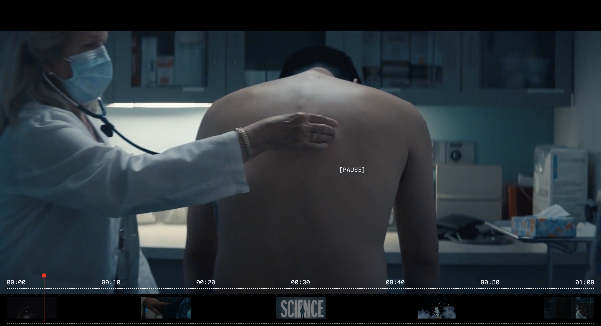

# Interactive Timeline Video Player
 

This is a custom video player built with JavaScript. It provides a custom interface for controlling video playback, including a timeline and a custom cursor.

## Features

- Play/Pause functionality
- Custom cursor
- Video timeline

## Usage

To use this video player, simply open the `index.html` file in your web browser.

## Author

- [Farid Vatani - Software Engineer](https://github.com/faridvatani) 

## Contributing

Contributions are welcome. Please feel free to fork this repository and open a pull request to add more features, fix bugs, improve documentation etc.

## Acknowledgements

This project was inspired by the "Awwwards Element" from [Inkfish](https://inkfishnyc.com/work/pfizer-science-will-win). The need for a more customizable video player interface led to the creation of this project. It was built with pure JavaScript, without any libraries.

## License

This project is licensed under the MIT License. See the [LICENSE](LICENSE) file for more details.